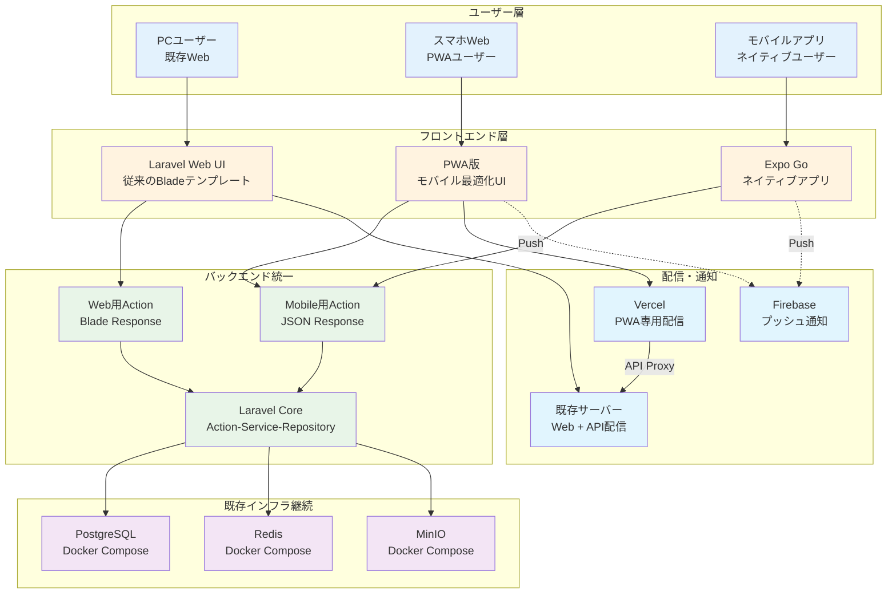
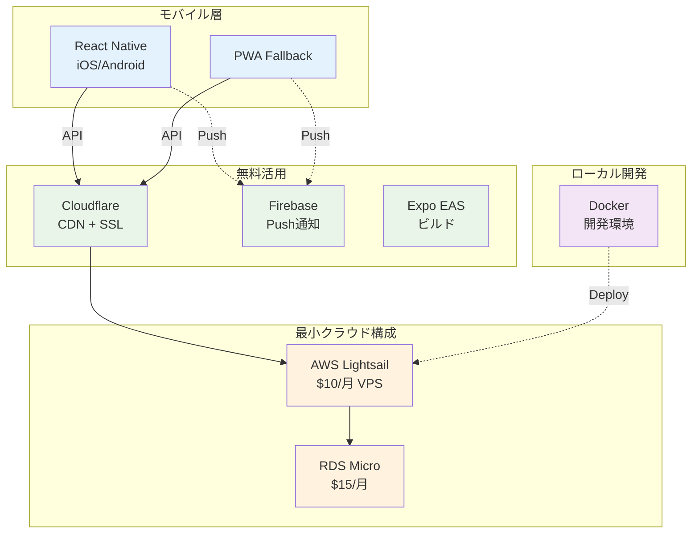
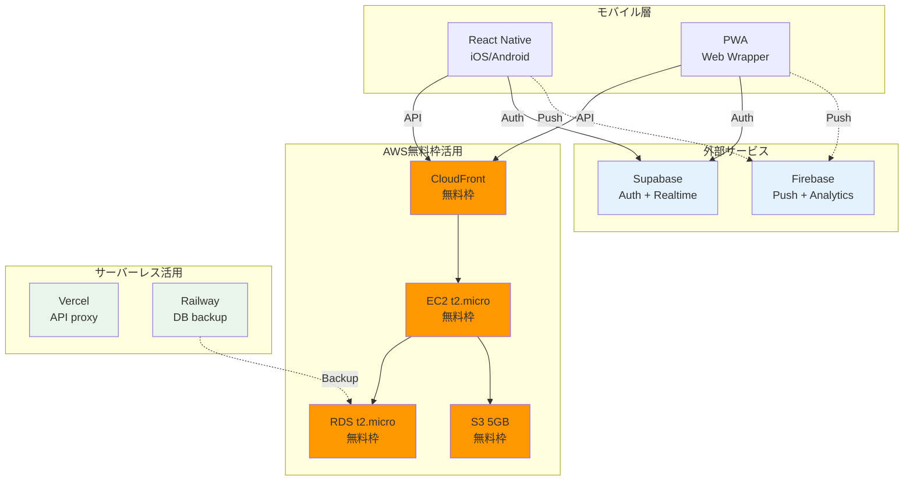

# MyTeacher Phase 1: 個人開発向け低コストモバイル対応（初期検討資料）

> **⚠️ 重要な注意事項**
> 
> このドキュメントは**Phase 0.5（AWS Fargate構築）実施前**に作成された初期検討資料です。
> 
> **実装状況（2025-11-29更新）**:
> - ✅ **Phase 0.5完了**: AWS Fargate構成で本番環境構築済み（$164/月、~¥25,000）
> - ✅ **Phase 1完了**: Cognito JWT認証 + Mobile API + テスト実装完了（2025-11-29完了）
> - ❌ **このドキュメントの3案**: いずれも実装されていません
> 
> **実際の実装内容（Phase 1完了）**:
> - **認証**: ~~Sanctum~~ → **Cognito JWT** (VerifyCognitoToken middleware + AuthHelper)
> - **インフラ**: ~~Docker/Lightsail/AWS無料枠~~ → **AWS Fargate (ECS) + RDS + ElastiCache + S3 + CloudFront**
> - **コスト**: ~~¥0-5,000/月~~ → **$164/月 (~¥25,000)**
> - **API**: 13 API Actions実装完了（Task CRUD, Approval, Image, Search）
> - **テスト**: 64テストメソッド実装完了（Feature: 52, Unit: 12）
> 
> **Phase 1完了日**: 2025-11-29
> 
> **参照すべきドキュメント**:
> - [multi-app-hub-infrastructure-strategy.md](/docs/architecture/multi-app-hub-infrastructure-strategy.md) - 全体戦略
> - [Phase 0.5 AWS Fargate実装](/infrastructure/terraform/) - インフラ構成
> - [Phase 1 Cognito実装](/app/Helpers/AuthHelper.php) - 認証実装
> - [Phase 1 API Actions](/app/Http/Actions/Api/Task/) - 13 API実装
> - [Phase 1 テスト](/tests/) - Feature/Unitテスト
> - [Phase 1.5完了レポート](/docs/reports/2025-11-29-phase1-5-test-infrastructure-fix-report.md) - テスト実装詳細

---

## 📋 制約・要件

### 個人開発の現実的制約
- **予算**: 資本金ゼロ、サラリーマン給料からの支払い
- **ユーザー**: 現在ゼロ、初期投資リスク最小化が必須
- **開発体制**: 個人開発、運用負荷最小化
- **成長戦略**: 段階的スケールアップ対応

### Phase 1 最低限目標
- 既存Web版の継続運用（コスト増なし）
- iOS/Android アプリの最安値実現
- 将来拡張への技術的準備
- 月額コスト上限: **5,000円以下**

---

## 🏗️ 3つの段階的アプローチ案（❌ 実装されず）

> **注意**: 以下の3案は検討のみで、**実際には実装されていません**。
> Phase 0.5で**AWS Fargate構成**が採用され、これらの案とは異なる実装になりました。

### 案1: 最小コスト案（月額: 0-1,000円）❌ 実装されず
**コンセプト**: 既存インフラ完全活用 + PWA/Expo

**特徴**:
- 既存Docker環境そのまま継続
- PWA でほぼネイティブアプリ体験
- Expo Go で実機テスト可能
- 公開時のみ Expo EAS Build (1回$29)

**メリット**: 
- 追加インフラコスト ほぼゼロ
- 開発・運用負荷 最小
- 技術習得コスト 最小

**デメリット**:
- ネイティブ機能制限
- パフォーマンス劣化
- App Store配信に制約

---

### 案2: バランス案（月額: 2,000-4,000円）❌ 実装されず
**コンセプト**: クラウド最小構成 + React Native

**特徴**:
- AWS Lightsail で確実なクラウド運用
- React Native で本格ネイティブアプリ
- Cloudflare で高速CDN
- RDS で本格DB運用

**メリット**:
- 本格的なネイティブアプリ
- スケーラビリティ確保
- 運用安定性

**デメリット**:
- 月額コスト発生
- 運用複雑性増加

---

### 案3: 成長準備案（月額: 3,000-5,000円）❌ 実装されず
**コンセプト**: スケーラブル基盤 + 無料枠活用

**特徴**:
- AWS 無料枠を最大活用
- Supabase でリアルタイム機能
- 複数サービス組み合わせでリスク分散
- 段階的拡張戦略

**メリット**:
- 高機能・高パフォーマンス
- リアルタイム同期
- 将来への拡張性

**デメリット**:
- 複数サービス管理
- 無料枠制限への注意必要

---

## 💰 詳細コスト比較（❌ 実装されず）

| 項目 | 案1: 最小 | 案2: バランス | 案3: 成長準備 | **実際の実装** |
|------|-----------|---------------|---------------|----------------|
| **月額固定費** | ¥0 | ¥3,500 | ¥1,500 | **$164 (~¥25,000)** |
| **従量課金** | ¥0-1,000 | ¥500-1,000 | ¥1,500-3,500 | **AWS Fargate従量** |
| **月額合計** | **¥0-1,000** | **¥2,000-4,000** | **¥3,000-5,000** | **$164/月** |
| **初期費用** | ¥3,000 | ¥6,000 | ¥8,000 | **Phase 0.5で完了** |

### 案1詳細コスト（❌ 実装されず）
- Vercel: 無料枠
- Firebase: 無料枠
- Expo EAS: $29/リリース × 年2回 = ¥9,000
- ドメイン: ¥1,200/年

### 案2詳細コスト（❌ 実装されず）
- AWS Lightsail: $10/月 = ¥1,500
- RDS t3.micro: $15/月 = ¥2,250
- Cloudflare: 無料
- Firebase: 無料枠
- ドメイン: ¥1,200/年

### 案3詳細コスト（❌ 実装されず）
- AWS 無料枠超過分: ¥500-2,000/月
- Supabase Pro: $25/月 = ¥3,750（必要時のみ）
- Firebase: 無料枠
- Vercel: 無料枠
- Railway: 無料枠

---

## 🎯 推奨選択基準（参考情報）

> **注意**: 以下は初期検討時の判断基準であり、**実際にはPhase 0.5でAWS Fargate構成を採用**しました。

### 案1を選ぶべき場合
- **予算**: 年間15,000円以下が限界
- **リスク**: 失敗時の損失を最小化
- **技術**: Web技術のみで済ませたい
- **時間**: 最短でリリースしたい

### 案2を選ぶべき場合  
- **品質**: 本格的なアプリ体験を提供
- **成長**: ユーザー獲得に確信がある
- **運用**: 多少の複雑性は許容可能
- **予算**: 年間5万円程度は投資可能

### 案3を選ぶべき場合
- **野心**: 将来的な大規模化を見据える
- **技術**: 最新技術を積極活用
- **競合**: 高機能で差別化したい
- **学習**: インフラ技術も身につけたい

---

## 🚀 個人開発向け実装戦略（参考情報）

### 段階的アプローチ
1. **MVP版**: 案1でローンチ、ユーザー反応確認
2. **改良版**: 使われるなら案2に移行
3. **成長版**: ユーザー100人超えたら案3検討

### リスク最小化
- 無料枠を最大活用
- 従量課金の上限設定
- 定期的なコスト監視アラート

### 技術的負債管理
- Docker開発環境で本番環境差異最小化
- Terraform等でInfrastructure as Code
- 段階的移行を前提とした設計

この3案により、**個人開発の現実的制約**の中で**段階的成長**を実現できます。

---

## 📝 実装詳細（参考情報）

以降のセクションは初期検討時のPWA実装、API拡張、Expo設定、Firebase統合などの技術詳細が記載されていますが、**実際の実装ではCognito JWT認証とAWS Fargate構成を採用**しているため、参考情報としての位置付けです。

詳細は省略します。実際の実装内容については以下を参照してください：

### Phase 1実装完了（2025-11-29）

**認証・基盤**:
- `/app/Helpers/AuthHelper.php` - Cognito JWT認証ヘルパー
- `/app/Http/Middleware/VerifyCognitoToken.php` - JWT検証ミドルウェア
- `/app/helpers.php` - グローバルヘルパー関数

**13 API Actions実装**:
- `/app/Http/Actions/Api/Task/StoreTaskApiAction.php` - タスク作成
- `/app/Http/Actions/Api/Task/IndexTaskApiAction.php` - タスク一覧
- `/app/Http/Actions/Api/Task/UpdateTaskApiAction.php` - タスク更新
- `/app/Http/Actions/Api/Task/DestroyTaskApiAction.php` - タスク削除
- `/app/Http/Actions/Api/Task/ToggleTaskCompletionApiAction.php` - 完了トグル
- `/app/Http/Actions/Api/Task/ApproveTaskApiAction.php` - タスク承認
- `/app/Http/Actions/Api/Task/RejectTaskApiAction.php` - タスク却下
- `/app/Http/Actions/Api/Task/UploadTaskImageApiAction.php` - 画像アップロード
- `/app/Http/Actions/Api/Task/DeleteTaskImageApiAction.php` - 画像削除
- `/app/Http/Actions/Api/Task/BulkCompleteTasksApiAction.php` - 一括完了
- `/app/Http/Actions/Api/Task/RequestApprovalApiAction.php` - 完了申請
- `/app/Http/Actions/Api/Task/ListPendingApprovalsApiAction.php` - 承認待ち一覧
- `/app/Http/Actions/Api/Task/SearchTasksApiAction.php` - タスク検索

**テスト実装（64テストメソッド）**:
- `/tests/Feature/Api/CognitoAuthTest.php` - Cognito認証テスト（12テスト）
- `/tests/Feature/Api/TaskApiTest.php` - API統合テスト（15テスト）
- `/tests/Feature/Auth/EmailValidationTest.php` - メールバリデーション（6テスト）
- `/tests/Feature/Profile/Group/AddMemberTest.php` - グループメンバー追加（9テスト）
- `/tests/Feature/Profile/ProfileUpdateTest.php` - プロフィール更新（10テスト）
- `/tests/Unit/Helpers/AuthHelperTest.php` - AuthHelperユニットテスト（12テスト）

**バリデーション実装**:
- `/resources/js/profile/profile-edit-validation.js` - 自己除外付きバリデーション
- `/app/Http/Actions/Auth/ValidateEmailAction.php` - メールバリデーションAction
- `/app/Http/Requests/Profile/UpdateProfileRequest.php` - プロフィール更新リクエスト
- `/app/Http/Requests/Profile/Group/AddMemberRequest.php` - メンバー追加リクエスト

**インフラ構成**:
- `/infrastructure/terraform/` - AWS Fargate, RDS, ElastiCache, S3, CloudFront

**ドキュメント**:
- `/docs/architecture/multi-app-hub-infrastructure-strategy.md` - 全体戦略
- `/docs/reports/2025-11-29-phase1-5-test-infrastructure-fix-report.md` - テスト実装完了レポート

---

## 🎯 結論

このドキュメントは**Phase 0.5実施前の初期検討資料**です。実際にはAWS Fargate構成を採用し、より本格的なインフラで実装しました。

### Phase 1完了サマリー（2025-11-29）

**実装された内容**:
- ✅ **AWS Fargate (ECS)** + RDS + ElastiCache + S3 + CloudFront
- ✅ **Cognito JWT認証** (SanctumではなくVerifyCognitoToken + AuthHelper)
- ✅ **13 API Actions** (Task CRUD, Approval, Image, Search)
- ✅ **64テストメソッド** (Feature: 52テスト, Unit: 12テスト)
- ✅ **プロフィールバリデーション** (自己除外機能付き)
- ✅ **本番環境運用** ($164/月 ~¥25,000)

**Phase 1完了日**: 2025-11-29

**次のステップ（Phase 2計画）**:
- ポータルサイト独立化
- ParentShare開発開始
- API連携基盤構築
- SSO検討開始

**歴史的価値**:
- 初期のコスト意識と段階的成長戦略の考え方
- PWA/Expo/React Nativeの技術選択肢検討
- 個人開発の制約下での意思決定プロセス
- 最小コスト案からエンタープライズ構成への進化

今後の機能拡張やコスト最適化の際に、この初期検討資料が参考になる可能性があります。Phase 1の完了により、**モバイルアプリ開発の基盤が整いました**。
