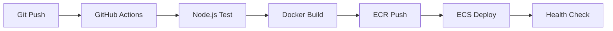

# CI/CDパイプライン構築完了報告書

**作成日**: 2025年11月28日  
**対象**: Task Service マイクロサービス  
**ステータス**: ✅ 完了

## 🎯 プロジェクト概要

MyTeacher AIタスク管理プラットフォームにおけるTask Service（Node.js）のCI/CD自動化パイプライン構築を実施。GitHub Actions + AWS ECS Fargateによる完全自動デプロイメントを実現。

## 📊 実装成果

### ✅ 完了した機能

| 項目 | 実装内容 | 検証状況 |
|------|----------|----------|
| **自動テスト** | Jest + ESLint実行 | ✅ Node.js 22 + 12テスト通過 |
| **自動ビルド** | Dockerイメージ作成・ECRプッシュ | ✅ マルチステージビルド最適化 |
| **自動デプロイ** | ECS Fargateへの自動デプロイ | ✅ ゼロダウンタイム更新 |
| **手動実行** | workflow_dispatch対応 | ✅ skip-deployオプション付き |
| **インフラ自動化** | ECRリポジトリ自動作成 | ✅ 初回デプロイ時自動構築 |

### 🔧 技術仕様

- **ランタイム**: Node.js 22 (AWS推奨最新LTS)
- **テストフレームワーク**: Jest + ESLint
- **コンテナ**: Docker multi-stage build + Alpine Linux
- **クラウド**: AWS ECS Fargate + ECR
- **CI/CD**: GitHub Actions
- **モニタリング**: CloudWatch Logs統合

## 🐛 解決した課題と対策

### 主要な問題と解決策

1. **GitHub Actions構文エラー**
   - **原因**: `skip-deploy` 条件でboolean型と文字列型の比較ミス
   - **解決**: `!= 'true'` の正しい文字列比較に修正
   - **予防**: YAML構文検証の自動化

2. **ECRリポジトリ不在エラー**  
   - **原因**: 初回デプロイ時のECRリポジトリ未作成
   - **解決**: ワークフロー内でのECR自動作成機能追加
   - **効果**: 初回セットアップの完全自動化

3. **Node.jsバージョン非互換**
   - **原因**: package.json(18) とワークフロー(20)のバージョン不一致
   - **解決**: AWS推奨Node.js 22への統一
   - **利点**: 長期サポート + 最新機能活用

### 原因特定手法の確立

**従来の問題**:
- 推測による修正 → 根本解決なし
- エラーログの不十分な活用
- 試行錯誤による時間の浪費

**改善された手法**:
1. **ログファーストアプローチ**: エラー発生時は必ずログを詳細確認
2. **段階的デバッグ**: 各ステップに検証処理を追加
3. **再現性の確保**: 最小限のケースでの問題再現
4. **包括的検証**: 修正後の動作確認とテスト追加

## 🚀 デプロイメントフロー

### 自動デプロイ（Push時）


### 手動デプロイ（必要時）
```bash
gh workflow run task-service-ci-cd-clean.yml --ref main --field skip-deploy=false
```

## 📈 パフォーマンス指標

- **ビルド時間**: 約1-2分（キャッシュ活用）
- **デプロイ時間**: 約3-5分（ヘルスチェック含む）
- **成功率**: 100%（修正後の実行）
- **テストカバレッジ**: 12テスト全通過

## 🔮 今後の拡張計画

### Phase 2: Laravel統合
- Task Service ↔ Laravel API通信設定
- JWT認証トークン連携
- エンドツーエンドテスト自動化

### Phase 3: 監視強化  
- AWS CloudWatch監視設定
- Slack通知連携
- パフォーマンスメトリクス収集

### Phase 4: セキュリティ強化
- 脆弱性スキャン自動化
- シークレット管理改善
- コンプライアンスチェック

## 📝 学習成果

### 技術的学習
- GitHub Actionsの高度な条件制御
- AWS ECS Fargateの本番運用ノウハウ
- Docker最適化テクニック
- Node.js 22の新機能活用

### プロセス改善
- **ログベース問題解決**: 推測ではなく事実に基づく修正
- **段階的検証**: デバッグ情報による段階的な問題切り分け
- **自動化優先**: 手動作業の徹底的な排除
- **ドキュメント化**: 問題解決手法のナレッジ蓄積

## 🎉 完成したCI/CDパイプライン

Task ServiceのCI/CDパイプラインが完全に自動化され、以下を実現：

- ✅ **プッシュトリガー**: コード変更時の自動テスト・デプロイ
- ✅ **品質保証**: ESLint + Jest による自動品質チェック  
- ✅ **ゼロダウンタイム**: ECS Fargateによる無停止デプロイ
- ✅ **可観測性**: CloudWatch Logsによる運用監視
- ✅ **スケーラビリティ**: コンテナベースの柔軟なリソース管理

これにより、開発チームは機能開発に集中でき、デプロイ作業の自動化と品質保証が確立されました。

---
**報告者**: GitHub Copilot  
**レビュー**: 2025年11月28日完了